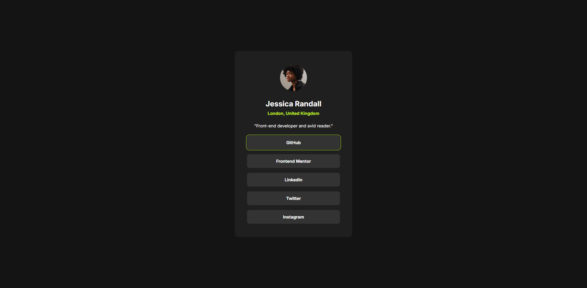
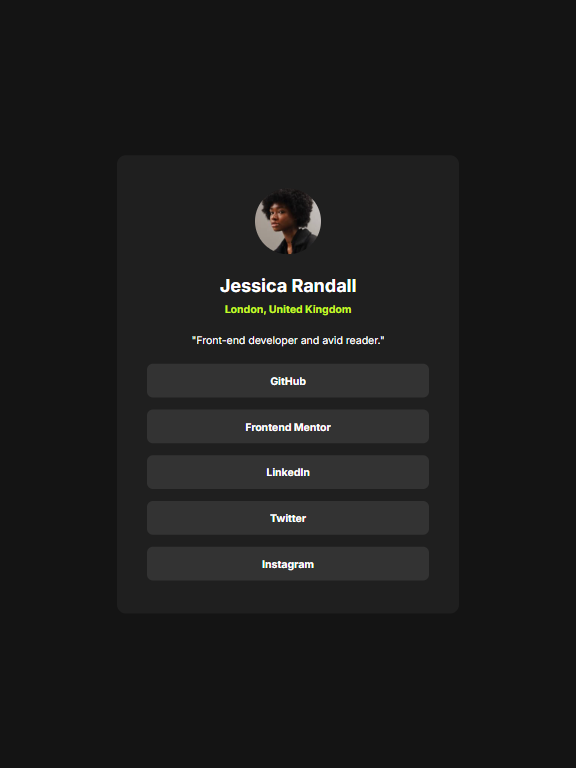
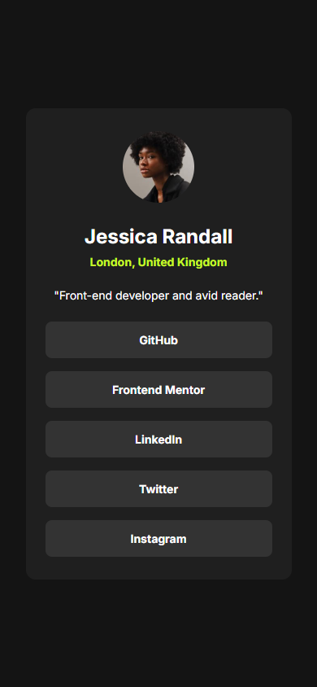

# Frontend Mentor - Social links profile solution

This is a solution to the [Social links profile challenge on Frontend Mentor](https://www.frontendmentor.io/challenges/social-links-profile-UG32l9m6dQ). Frontend Mentor challenges help you improve your coding skills by building realistic projects. 

## Table of contents

- [Overview](#overview)
  - [The challenge](#the-challenge)
  - [Screenshot](#screenshot)
  - [Links](#links)
- [My process](#my-process)
  - [Built with](#built-with)
  - [What I learned](#what-i-learned)
  - [Continued development](#continued-development)
- [Author](#author)

## Overview

### The challenge

Users should be able to:

- See hover and focus states for all interactive elements on the page

### Screenshot

#### Desktop

#### Tablet

#### Mobile

### Links

- Live Site URL: [Add live site URL here](https://social-links-profile-eta-six.vercel.app/)

## My process

### Built with

- Semantic HTML5 markup
- Basic CSS, Flexbox and Media Queries

### What I learned

As this project has specific layout requirements for various devices, I have started learning about `rem` units and the `max-width` CSS property to enhance page responsiveness. Additionally, I’ve explored media queries to adjust the profile card’s design for different screen sizes.

### Continued development

Now I'm feeling more confortable with basic flexbox.

## Author

- Frontend Mentor - [@yourusername](https://www.frontendmentor.io/profile/AlvaroPrates)
